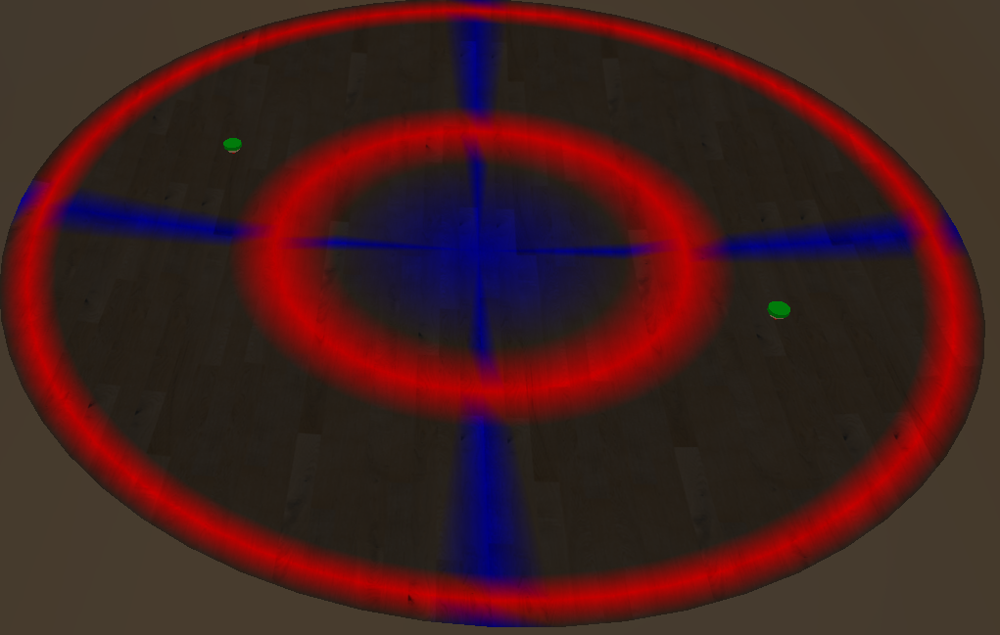

# BattleBeyz

BattleBeyz is the first 3D Beyblade game with accurate spinning top physics.



I also wanted to learn from the process of creating a game from scratch, so everything is written in C++ (OpenGL / ImGui) with no physics libraries. Any collaboration or feedback is welcome!

# Features (So far!)

- Centralized Game Engine and States
- Realistic Beyblade Physics
- JSON-style saving and loading
- Profile and Input Manager
- 3D Camera Control and Rendering
- Texture, Mesh, Lighting/Shading
- Logging and Debug Mode

## Coming Soon
- Mesh import
- Pre-match selection screen and reset

# Installation
# 1. Clone the Repository
1. Open your terminal (Command Prompt, PowerShell, or your preferred terminal).
2. Navigate to the folder where you'd like to store the project.
3. Run the following command to clone the repository:
   ```bash
   git clone https://github.com/TheRickyZhang/BattleBeyz
   ```


# 2. Installing vcpkg and dependencies
## **Windows**
1. Open **PowerShell** as Administrator.
2. Clone the `vcpkg` repository:
   ```powershell
   git clone https://github.com/microsoft/vcpkg.git C:\vcpkg
   cd C:\vcpkg
   ```
3. Run the bootstrap script to build vcpkg:
   ```powershell
   .\bootstrap-vcpkg.bat
   ```
4. Add `vcpkg` to your system's `PATH` temporarily:
   ```powershell
   $env:PATH += ";C:\vcpkg"
   ```
   For permanent access, update your environment variables in System Settings.

### **Mac/Linux**
1. Open a terminal.
2. Clone the `vcpkg` repository:
   ```bash
   git clone https://github.com/microsoft/vcpkg.git ~/vcpkg
   cd ~/vcpkg
   ```
3. Run the bootstrap script to build vcpkg:
   ```bash
   ./bootstrap-vcpkg.sh
   ```
4. Add `vcpkg` to your `PATH` by appending this line to your shell configuration file (`~/.bashrc` or `~/.zshrc`):
   ```bash
   export PATH=$PATH:~/vcpkg
   ```

## Integrating with CMake

Make vcpkg's toolchain file available to CMake.
   ```bash
   vcpkg integrate install
   ```

### Static Libraries (Recommended):
```bash
vcpkg install glfw3:x64-windows-static
vcpkg install glew:x64-windows-static
vcpkg install freetype:x64-windows-static
vcpkg install zlib:x64-windows-static
vcpkg install glm:x64-windows-static
```

### **Mac/Linux **
For Mac/Linux users:
- Replace `x64-windows-static` with `x64-osx` or `x64-linux`.
- Install system dependencies for OpenGL and GLFW (if not handled by vcpkg):
  ```bash
  sudo apt install libglfw3-dev libglew-dev freeglut3-dev zlib1g-dev
  ```
If you prefer to use dynamic libraries, simply omit the `-static` from the above commands.

## Verify local libraries

The project already includes prebuilt libraries (ImGui, stb, tinyobjloader). However, if they are missing for some reason and need to rebuilt from scracth, you can execute the following.
```bash
cd lib
# ImGui
curl -LO https://github.com/ocornut/imgui/archive/refs/tags/v1.90.8.zip
unzip v1.90.8.zip
# stb
curl -LO https://github.com/nothings/stb/archive/refs/tags/v0.8.zip
unzip v0.8.zip
# tinyobjloader
curl -O https://raw.githubusercontent.com/tinyobjloader/tinyobjloader/release/tiny_obj_loader.h
```

## Project Directory
After installation, your project structure should have these at minimum: (remember that /vcpkg should be installed in your root!)

```
Project Root/
├── src/                     # Source files
├── lib/                     # Local libraries (ImGui, stb, tinyobjloader)
│   ├── imgui-1.90.8/
│   ├── stb/
│   ├── tiny_obj_loader.h
├── assets/                  # Game assets (textures, models, etc.)
├── build/                   # Build files (generated by CMake)
└── CMakeLists.txt           # CMake build file
```

Make sure your `CMakeLists.txt` file points to the correct locations for **vcpkg** and libraries. The current version should be correct, but ensure you modify it if vcpkg is located elsewhere.
```cmake
set(CMAKE_TOOLCHAIN_FILE "C:/vcpkg/scripts/buildsystems/vcpkg.cmake" CACHE STRING "Vcpkg toolchain file")
set(CMAKE_PREFIX_PATH "C:/vcpkg/installed/x64-windows-static" CACHE PATH "Path to vcpkg installed packages")
```

# 3. Create build folder
**Run CMake** to generate the Visual Studio solution and project files:
   ```bash
   cmake -S . -B build
   ```

# 4. Build and Run in Visual Studio
1. Open Visual Studio 2022, and either:
   - Select **File -> Open -> Project/Solution**, then click `BattleBeyz.sln`, located in /build
   - Right click `BattleBeyz.sln` and open with Visual Studio
2. Choose the desired build configuration:
   - **Debug** for development and debugging. (Preferred for development)
   - **Release** for optimized performance.
3. Run the application with `Ctrl+F5` or debug it with `F5`.

